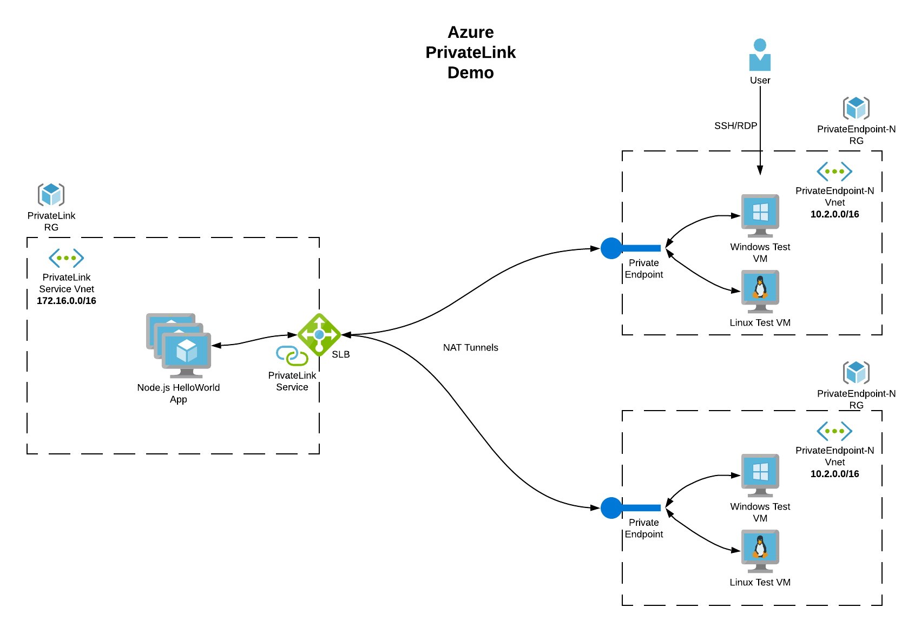

# DEPLOY PRIVATE LINK SERVICE, ENDPOINT, AND WEB APP 

## DESCRIPTION

This demo was created to test out Azure Private Link functionality. I was looking to show how Azure Private Link can be leveraged to provide connectivity to a central service/application from multiple Vnets all configured with overlapping IP space. This would be very useful in situatations where IP space is limited, or where IP space reuse is expected. 

This project will build the following resources:

- Private Link Resource Group
    - Private Link Vnet (172.16.0.0/16)
    - Azure Standard Load Balancer (Internal)
    - Private Link Service
    - 3 Ubuntu servers running a Hello World Node.js web app. 
        - Deployed into the SLB backend pool
        - The web app is published to the Private Link Service (PLS). 

- `N` number of Private Endpoint Resource Groups
    - Private Endpoint Vnet (10.2.0.0/16)
    - Private Endpoint subscribed to the Private Link Service.
    - VM(s) to test the Private Endpoint connection. 
        - Choice of Windows or Linux VM (or both) to test the connection.
    - Public IP address(s) for SSH/RDP access to test VM's.


## ARCHITECTURE

_Example Arcitecture showing 2 Private Endpoint Resource Groups deployed:_




## DEPENDENCIES

This project requires the following packages:

- azure-cli
- make
- jq


## VARIABLES

This project leverages a `config.sh` file containing variables. The following variables are required to deploy the demo:

### Private Link Resource group
pl_rg_name='' 
- A name for the Private Link Resource Group 

location='' 
- Azure region to deploy this demo 

### Private Endpoint resource group
pe_rg_prefix=''
- Name prefix for the Private Endpoint resource groups

num_of_pe=''
- Number of Private Endpoint resource groups to deploy

windows_test=''
- If value is set to `true`, a Windows VM will be deployed into the Private Endpoint RG to test the connection via browser.

linux_test=''
- If value is set to `true`, a Linux VM will be deployed into the Private Endpoint RG to test the connection via curl.

*If windows_test, or linux_test value is set to anything other than **true**, no test VM will be deployed*

### VM username and password
admin_username=''
- Admin user name for authentication

admin_password=''
- Admin password for authentication. Value for the password must be between **12 and 72** characters long.

### Path to ssh key
ssh_key_path=''
- path to public SSH key for authentication


## USEAGE

I created a makefile to deploy this solution to stitch 3 separate files together. This also makes deployments, and clean up, super easy. 


**Using Make**

- Clone this repo to your local machine

- Update `config.sh` with the variable values you would like to use
    - feel Free to update and add more variables if desired

- From the root of the project type: `make`

- After project is finished deploying, you can test the connection by hitting the Private Endpoint from one of your test VM's.
    - Gather Private Endpoint IP address:
    ```az network private-endpoint show --name <PE_NAME> --resource-group <RG_NAME>```

    - Either SSH to your Linux Test VM, or RDP to Windows Test VM.
        - From Windows VM, launch IE (or another browser) and put the Private Endpoint IP in the address bar.
        - From Linux VM, at the command prompt use curl to hit the Private Endpoint. ```curl http://<PrivateEndpoint-IP>``` 

- To clean the project up and delete the entire Resource Group type `make clean`


**Running scripts directly**

- Clone this repo to your local machine

- Update `config.sh` with the variable values you would like to use
    - feel Free to update to add more variables if desired

- From the root of the project, run the scripts in the following order:
    - create-privateLinkService.sh
    - create-HelloWorldApp.sh
    - create-privateEndpoint.sh

- After project is finished deploying, you can test the connection by hitting the Private Endpoint from one of your test VM's.
    - Gather Private Endpoint IP address:
    ```az network private-endpoint show --name <PE_NAME> --resource-group <RG_NAME>```

    - Either SSH to LinTestVM, or RDP to WinTestVM.
        - From Windows VM, launch IE (or another browser) and put the Private Endpoint IP in the address bar.
        - From Linux VM, at the command prompt use curl to hit the Private Endpoint. ```curl http://<PrivateEndpoint-IP>``` 

- To delete the resource group when you are finished, run the destroy script: 
  ```sh destroy_env.sh```